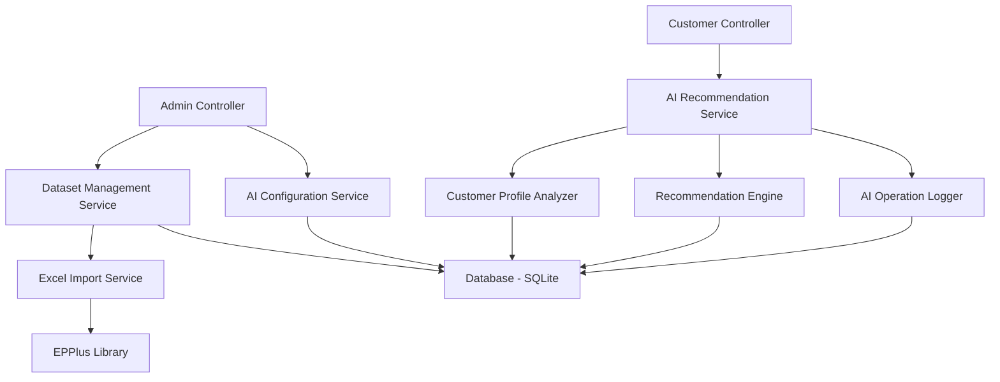

# Design Document: AI-Powered Meal Recommendations

## Overview

The AI-powered meal recommendation system extends the existing ASP.NET Core MVC meal prep service with intelligent, personalized meal suggestions. The system consists of three main components:

1. **Training Dataset Management**: Admin interface for CRUD operations on training data imported from Excel
2. **AI Recommendation Engine**: Rule-based logic that analyzes customer profiles and generates personalized meal suggestions
3. **AI Operations Monitoring**: Logging and configuration management for AI features

The design leverages existing entities (Account, HealthProfile, Order, Meal, Recipe, Ingredient, Allergy, FoodPreference) and introduces new entities (TrainingDataset, AIConfiguration, AIOperationLog) to support AI functionality. The initial implementation uses rule-based algorithms with a design that supports future ML.NET integration.

## Architecture

### System Components



### Component Responsibilities

**Dataset Management Service**
- CRUD operations for TrainingDataset entities
- Validation of training data records
- Coordination with Excel Import Service

**Excel Import Service**
- Reading PRN222_Datasets.xlsx using EPPlus
- Parsing and validating Excel rows
- Batch insertion into database with error handling
- Import summary generation

**AI Recommendation Service**
- Orchestrates recommendation generation workflow
- Validates AI feature availability via AIConfiguration
- Delegates to Customer Profile Analyzer and Recommendation Engine
- Coordinates logging through AI Operation Logger

**Customer Profile Analyzer**
- Retrieves customer Health_Profile, Allergy, FoodPreference data
- Fetches order history for variety analysis
- Constructs comprehensive customer context object

**Recommendation Engine**
- Implements rule-based scoring algorithm
- Filters meals based on allergies and dietary restrictions
- Calculates nutritional balance across recommendations
- Ranks and selects top 5-10 meals

**AI Operation Logger**
- Creates AIOperationLog entries for all AI operations
- Logs success, failure, and performance metrics
- Provides queryable audit trail

**AI Configuration Service**
- Manages AIConfiguration entity (enable/disable features)
- Provides configuration queries for other services
- Admin interface for viewing operation logs

## Components and Interfaces

### New Entities

**TrainingDataset**
```csharp
public class TrainingDataset
{
    public int Id { get; set; }
    public string CustomerSegment { get; set; }  // e.g., "Athletic", "Weight Loss", "Diabetic"
    public string PreferredMealTypes { get; set; }  // JSON array of meal types
    public int AverageCalorieTarget { get; set; }
    public string CommonAllergies { get; set; }  // JSON array of common allergies
    public string RecommendationWeights { get; set; }  // JSON object with scoring weights
    public DateTime CreatedAt { get; set; }
    public DateTime? UpdatedAt { get; set; }
}
```

**AIConfiguration**
```csharp
public class AIConfiguration
{
    public int Id { get; set; }
    public bool IsEnabled { get; set; }
    public int MinRecommendations { get; set; }  // Default: 5
    public int MaxRecommendations { get; set; }  // Default: 10
    public int RecommendationCacheDurationMinutes { get; set; }  // Default: 60
    public string ConfigurationJson { get; set; }  // Additional settings as JSON
    public DateTime UpdatedAt { get; set; }
    public string UpdatedBy { get; set; }  // Admin username
}
```

**AIOperationLog**
```csharp
public class AIOperationLog
{
    public int Id { get; set; }
    public string OperationType { get; set; }  // "Recommendation", "Import", "Configuration"
    public DateTime Timestamp { get; set; }
    public string Status { get; set; }  // "Success", "Failure", "Warning"
    public int? CustomerId { get; set; }
    public string InputParameters { get; set; }  // JSON
    public string OutputSummary { get; set; }  // JSON
    public string ErrorMessage { get; set; }
    public string StackTrace { get; set; }
    public int ExecutionDurationMs { get; set; }
}
```

### Service Interfaces

**IDatasetManagementService**
```csharp
public interface IDatasetManagementService
{
    Task<IEnumerable<TrainingDataset>> GetAllAsync();
    Task<TrainingDataset> GetByIdAsync(int id);
    Task<TrainingDataset> CreateAsync(TrainingDataset dataset);
    Task<TrainingDataset> UpdateAsync(TrainingDataset dataset);
    Task<bool> DeleteAsync(int id);
    Task<ValidationResult> ValidateAsync(TrainingDataset dataset);
}
```

**IExcelImportService**
```csharp
public interface IExcelImportService
{
    Task<ImportResult> ImportFromExcelAsync(string filePath);
    Task<bool> ShouldAutoImportAsync();  // Checks if database is empty
}

public class ImportResult
{
    public int SuccessCount { get; set; }
    public int ErrorCount { get; set; }
    public List<string> Errors { get; set; }
    public TimeSpan Duration { get; set; }
}
```

**IAIRecommendationService**
```csharp
public interface IAIRecommendationService
{
    Task<RecommendationResult> GenerateRecommendationsAsync(int customerId);
    Task<bool> IsAIEnabledAsync();
}

public class RecommendationResult
{
    public bool Success { get; set; }
    public List<MealRecommendation> Recommendations { get; set; }
    public string ErrorMessage { get; set; }
    public NutritionalSummary NutritionalSummary { get; set; }
}

public class MealRecommendation
{
    public Meal Meal { get; set; }
    public double RelevanceScore { get; set; }
    public string ReasoningExplanation { get; set; }
    public NutritionalInfo NutritionalInfo { get; set; }
}
```

**ICustomerProfileAnalyzer**
```csharp
public interface ICustomerProfileAnalyzer
{
    Task<CustomerContext> AnalyzeCustomerAsync(int customerId);
}

public class CustomerContext
{
    public Account Customer { get; set; }
    public HealthProfile HealthProfile { get; set; }
    public List<Allergy> Allergies { get; set; }
    public List<FoodPreference> Preferences { get; set; }
    public List<Order> OrderHistory { get; set; }
    public bool HasCompleteProfile { get; set; }
    public List<string> MissingDataWarnings { get; set; }
}
```

**IRecommendationEngine**
```csharp
public interface IRecommendationEngine
{
    Task<List<MealRecommendation>> GenerateRecommendationsAsync(
        CustomerContext context, 
        int minCount, 
        int maxCount);
}
```

**IAIOperationLogger**
```csharp
public interface IAIOperationLogger
{
    Task LogOperationAsync(AIOperationLog log);
    Task<AIOperationLog> StartOperationAsync(string operationType, string inputParameters);
    Task CompleteOperationAsync(int logId, string status, string outputSummary, int durationMs);
    Task FailOperationAsync(int logId, Exception ex, int durationMs);
}
```

**IAIConfigurationService**
```csharp
public interface IAIConfigurationService
{
    Task<AIConfiguration> GetConfigurationAsync();
    Task<AIConfiguration> UpdateConfigurationAsync(AIConfiguration config, string adminUsername);
    Task<IEnumerable<AIOperationLog>> GetOperationLogsAsync(int pageNumber, int pageSize, string filterStatus);
}
```

## Data Models

### Database Schema Changes

**New Tables**

```sql
CREATE TABLE TrainingDatasets (
    Id INTEGER PRIMARY KEY AUTOINCREMENT,
    CustomerSegment TEXT NOT NULL,
    PreferredMealTypes TEXT NOT NULL,
    AverageCalorieTarget INTEGER NOT NULL,
    CommonAllergies TEXT,
    RecommendationWeights TEXT NOT NULL,
    CreatedAt TEXT NOT NULL,
    UpdatedAt TEXT
);

CREATE TABLE AIConfigurations (
    Id INTEGER PRIMARY KEY AUTOINCREMENT,
    IsEnabled INTEGER NOT NULL DEFAULT 1,
    MinRecommendations INTEGER NOT NULL DEFAULT 5,
    MaxRecommendations INTEGER NOT NULL DEFAULT 10,
    RecommendationCacheDurationMinutes INTEGER NOT NULL DEFAULT 60,
    ConfigurationJson TEXT,
    UpdatedAt TEXT NOT NULL,
    UpdatedBy TEXT NOT NULL
);

CREATE TABLE AIOperationLogs (
    Id INTEGER PRIMARY KEY AUTOINCREMENT,
    OperationType TEXT NOT NULL,
    Timestamp TEXT NOT NULL,
    Status TEXT NOT NULL,
    CustomerId INTEGER,
    InputParameters TEXT,
    OutputSummary TEXT,
    ErrorMessage TEXT,
    StackTrace TEXT,
    ExecutionDurationMs INTEGER NOT NULL,
    FOREIGN KEY (CustomerId) REFERENCES Accounts(Id)
);

CREATE INDEX idx_operation_logs_timestamp ON AIOperationLogs(Timestamp DESC);
CREATE INDEX idx_operation_logs_status ON AIOperationLogs(Status);
CREATE INDEX idx_operation_logs_customer ON AIOperationLogs(CustomerId);
```

### Excel File Structure

The PRN222_Datasets.xlsx file should have the following columns:
- CustomerSegment (string)
- PreferredMealTypes (comma-separated string)
- AverageCalorieTarget (integer)
- CommonAllergies (comma-separated string)
- RecommendationWeights (JSON string)

### Recommendation Scoring Algorithm

The rule-based recommendation engine uses a weighted scoring system:

**Score Calculation**
```
MealScore = (AllergyFilter × 1000) +
            (DietaryRestrictionMatch × 100) +
            (PreferenceMatch × 50) +
            (NutritionalBalance × 30) +
            (VarietyBonus × 20) +
            (CalorieAlignment × 10)

Where:
- AllergyFilter: 0 if meal contains allergen, 1 otherwise (eliminates meal if 0)
- DietaryRestrictionMatch: 0-1 based on how well meal matches restrictions
- PreferenceMatch: 0-1 based on ingredient/meal type preferences
- NutritionalBalance: 0-1 based on how meal contributes to balanced nutrition
- VarietyBonus: 0-1 based on difference from recent orders
- CalorieAlignment: 0-1 based on proximity to customer's calorie goals
```

**Filtering Logic**
1. Retrieve all available meals from database
2. Filter out meals containing customer allergies (hard constraint)
3. Calculate score for each remaining meal
4. Sort meals by score descending
5. Select top N meals (between MinRecommendations and MaxRecommendations)
6. Ensure nutritional diversity in final selection

**Nutritional Balance Calculation**
```
For each recommended meal set:
- Total Calories = Sum of all meal calories
- Protein Ratio = Total Protein / Total Calories
- Carb Ratio = Total Carbs / Total Calories
- Fat Ratio = Total Fats / Total Calories

Target Ratios (adjustable via TrainingDataset):
- Protein: 25-35%
- Carbs: 40-50%
- Fats: 20-30%

Balance Score = 1 - Average deviation from target ratios
```

## Error Handling

### Error Categories and Responses

**Excel Import Errors**
- File not found: Log warning, continue without import, notify admin
- Invalid format: Log specific row errors, import valid rows, return summary
- Database errors: Rollback transaction, log error, return failure result

**Recommendation Generation Errors**
- Customer not found: Return user-friendly error message
- Incomplete profile: Generate recommendations with available data, log warnings
- No suitable meals: Return message explaining constraints, suggest profile updates
- Database errors: Log error with full context, return graceful error message

**Configuration Errors**
- Invalid configuration values: Validate before saving, return validation errors
- Concurrent updates: Use optimistic concurrency, retry on conflict

### Retry Logic

For transient failures (database timeouts, temporary locks):
```csharp
Retry Policy:
- Max attempts: 3
- Initial delay: 100ms
- Backoff multiplier: 2
- Max delay: 1000ms
- Retry on: SqliteException with transient error codes
```

### Logging Strategy

**Log Levels**
- Information: Successful operations, configuration changes
- Warning: Incomplete data, fallback behavior, import errors
- Error: Operation failures, exceptions, data integrity issues
- Critical: System-wide failures, configuration corruption

**Structured Logging**
All logs include:
- Timestamp (UTC)
- Operation type
- Customer ID (when applicable)
- Execution duration
- Input parameters (sanitized)
- Result summary or error details


## Correctness Properties

A property is a characteristic or behavior that should hold true across all valid executions of a system—essentially, a formal statement about what the system should do. Properties serve as the bridge between human-readable specifications and machine-verifiable correctness guarantees.

### Dataset Management Properties

**Property 1: Training dataset creation persistence**
*For any* valid training dataset record, creating it through the service should result in the record being retrievable from the database with all attributes preserved.
**Validates: Requirements 1.2**

**Property 2: Training dataset update persistence**
*For any* existing training dataset record and valid modifications, updating the record should result in the changes being persisted to the database and retrievable.
**Validates: Requirements 1.3**

**Property 3: Training dataset deletion completeness**
*For any* existing training dataset record, deleting it should result in the record no longer being retrievable from the database.
**Validates: Requirements 1.4**

**Property 4: Invalid dataset rejection**
*For any* training dataset record with invalid data (missing required fields, invalid JSON, negative calorie targets), the validation should reject it and return descriptive error messages.
**Validates: Requirements 1.5**

### Excel Import Properties

**Property 5: Excel import row validation**
*For any* Excel file with mixed valid and invalid rows, the import process should validate each row independently and import all valid rows while logging errors for invalid ones.
**Validates: Requirements 2.3, 2.4**

**Property 6: Import summary accuracy**
*For any* Excel import operation, the returned summary should accurately reflect the count of successfully imported rows and the count of errors encountered.
**Validates: Requirements 2.5**

### Customer Profile Analysis Properties

**Property 7: Complete customer context retrieval**
*For any* customer ID, the profile analyzer should retrieve all associated data including Health_Profile, Allergy records, FoodPreference records, and Order history in a single customer context object.
**Validates: Requirements 3.1, 3.2, 3.3, 3.4**

**Property 8: Graceful handling of incomplete profiles**
*For any* customer with missing profile data (no health profile, no preferences, etc.), the system should generate recommendations using available data and log warnings about missing information.
**Validates: Requirements 3.5**

### Recommendation Generation Properties

**Property 9: Recommendation count constraints**
*For any* recommendation request, the generated meal suggestions should number between 5 and 10 (inclusive), unless insufficient meals are available.
**Validates: Requirements 4.1**

**Property 10: Allergy exclusion (Critical Safety Property)**
*For any* customer with recorded allergies, all recommended meals must exclude any ingredients that match the customer's allergy list.
**Validates: Requirements 4.2**

**Property 11: Dietary restriction prioritization**
*For any* customer with dietary restrictions in their health profile, meals matching those restrictions should have higher relevance scores than meals that don't match.
**Validates: Requirements 4.3**

**Property 12: Nutritional balance calculation**
*For any* set of recommended meals, the system should calculate and include the total calories, protein, carbohydrates, and fats across all meals, with each meal's nutritional information included in the response.
**Validates: Requirements 4.4, 8.1, 8.5**

**Property 13: Order history variety**
*For any* customer with order history, recommended meals should differ from recently ordered meals, with meals not in recent history receiving higher variety bonus scores.
**Validates: Requirements 4.5**

**Property 14: Relevance score ordering**
*For any* set of recommended meals, the meals should be ordered by relevance score in descending order (highest score first).
**Validates: Requirements 4.6**

**Property 15: Calorie goal alignment**
*For any* customer with calorie goals specified in their health profile, meals with calorie counts closer to the target should receive higher scores than meals further from the target.
**Validates: Requirements 8.2**

**Property 16: Macronutrient variety**
*For any* set of recommended meals, the macronutrient distribution (protein, carbs, fats) should show variety across the meal set rather than all meals having identical ratios.
**Validates: Requirements 8.3**

**Property 17: Incomplete nutritional data exclusion**
*For any* meal with missing nutritional data (null or zero values for calories, protein, carbs, or fats), the meal should be excluded from recommendations and the exclusion should be logged.
**Validates: Requirements 8.4**

### AI Operation Logging Properties

**Property 18: Successful operation logging**
*For any* successful AI operation, the system should create an Operation_Log entry containing timestamp, operation type, status "Success", customer ID, number of recommendations, and execution duration.
**Validates: Requirements 5.1, 5.2, 5.4, 5.5**

**Property 19: Failed operation logging**
*For any* failed AI operation, the system should create an Operation_Log entry containing timestamp, operation type, status "Failure", error message, stack trace, input parameters, and execution duration.
**Validates: Requirements 5.3, 5.4, 5.5**

**Property 20: Log persistence immediacy**
*For any* AI operation log entry, the log should be immediately queryable from the database after the logging call completes.
**Validates: Requirements 5.5**

### AI Configuration Properties

**Property 21: AI enablement effect**
*For any* AI configuration state, when AI features are enabled, recommendation requests should be processed and return meal suggestions.
**Validates: Requirements 6.2**

**Property 22: AI disablement effect**
*For any* AI configuration state, when AI features are disabled, recommendation requests should be rejected with a user-friendly message indicating the feature is unavailable.
**Validates: Requirements 6.3**

**Property 23: Operation log filtering**
*For any* operation log query with status filter (Success, Failure, Warning), the returned logs should only include entries matching the specified status.
**Validates: Requirements 6.5**

### Error Handling Properties

**Property 24: Recommendation exception handling**
*For any* exception thrown during recommendation generation, the system should log the full error details (message, stack trace, input parameters) and return a user-friendly error message to the caller.
**Validates: Requirements 7.3**

**Property 25: Transient failure retry**
*For any* transient database failure (timeout, lock), the system should retry the operation up to 3 times with exponential backoff before failing.
**Validates: Requirements 7.4**

**Property 26: Critical error severity logging**
*For any* critical error (system-wide failure, data corruption), the system should create an Operation_Log entry with appropriate severity indicators for administrator notification.
**Validates: Requirements 7.5**

## Testing Strategy

### Dual Testing Approach

The testing strategy employs both unit testing and property-based testing to ensure comprehensive coverage:

**Unit Tests**: Focus on specific examples, edge cases, and integration points
- Specific scenarios (first-time import, disabled AI state)
- Edge cases (missing Excel file, corrupted data, empty database)
- Integration between components (service layer to database)
- Error conditions (invalid input, missing data)

**Property-Based Tests**: Verify universal properties across randomized inputs
- Generate random training datasets, customer profiles, and meal data
- Test properties hold for 100+ iterations with varied inputs
- Catch edge cases that manual test cases might miss
- Validate business rules across the entire input space

### Property-Based Testing Configuration

**Framework**: Use a property-based testing library appropriate for C#/.NET:
- Recommended: **FsCheck** (mature, well-integrated with xUnit/NUnit)
- Alternative: **CsCheck** (newer, C#-native)

**Test Configuration**:
- Minimum 100 iterations per property test
- Each test tagged with feature name and property number
- Tag format: `[Trait("Feature", "ai-meal-recommendations")]` and `[Trait("Property", "Property 10: Allergy exclusion")]`

**Example Property Test Structure**:
```csharp
[Fact]
[Trait("Feature", "ai-meal-recommendations")]
[Trait("Property", "Property 10: Allergy exclusion")]
public void Property_AllergyExclusion_NoRecommendedMealsContainAllergens()
{
    Prop.ForAll(
        GenerateCustomerWithAllergies(),
        GenerateMealDatabase(),
        async (customer, meals) =>
        {
            // Arrange: Set up database with customer and meals
            // Act: Generate recommendations
            var result = await _recommendationService.GenerateRecommendationsAsync(customer.Id);
            
            // Assert: No recommended meals contain customer's allergens
            var customerAllergens = customer.Allergies.Select(a => a.IngredientId).ToHashSet();
            foreach (var recommendation in result.Recommendations)
            {
                var mealIngredients = recommendation.Meal.Recipe.Ingredients.Select(i => i.Id);
                Assert.Empty(mealIngredients.Intersect(customerAllergens));
            }
        }
    ).QuickCheckThrowOnFailure(maxTest: 100);
}
```

### Test Coverage Goals

**Unit Test Coverage**:
- All service methods: 100%
- Controller actions: 100%
- Error handling paths: 100%
- Edge cases: Comprehensive coverage

**Property Test Coverage**:
- All 26 correctness properties: 100%
- Each property implemented as a single property-based test
- Minimum 100 iterations per property

### Integration Testing

**Database Integration**:
- Use in-memory SQLite for fast test execution
- Seed test database with realistic data
- Test migrations and schema changes

**Excel Import Integration**:
- Test with sample Excel files (valid, invalid, mixed)
- Verify EPPlus integration
- Test file system error handling

**End-to-End Scenarios**:
- Complete recommendation workflow (profile → analysis → recommendations → logging)
- Admin workflows (import → manage datasets → configure AI → view logs)
- Error scenarios (disabled AI, missing data, exceptions)

### Performance Testing

While not part of automated unit/property tests, the following performance characteristics should be validated manually:

- Recommendation generation: < 500ms for typical customer profile
- Excel import: < 5 seconds for 1000 rows
- Operation log queries: < 100ms with pagination
- Database queries: Proper indexing verified via query plans
